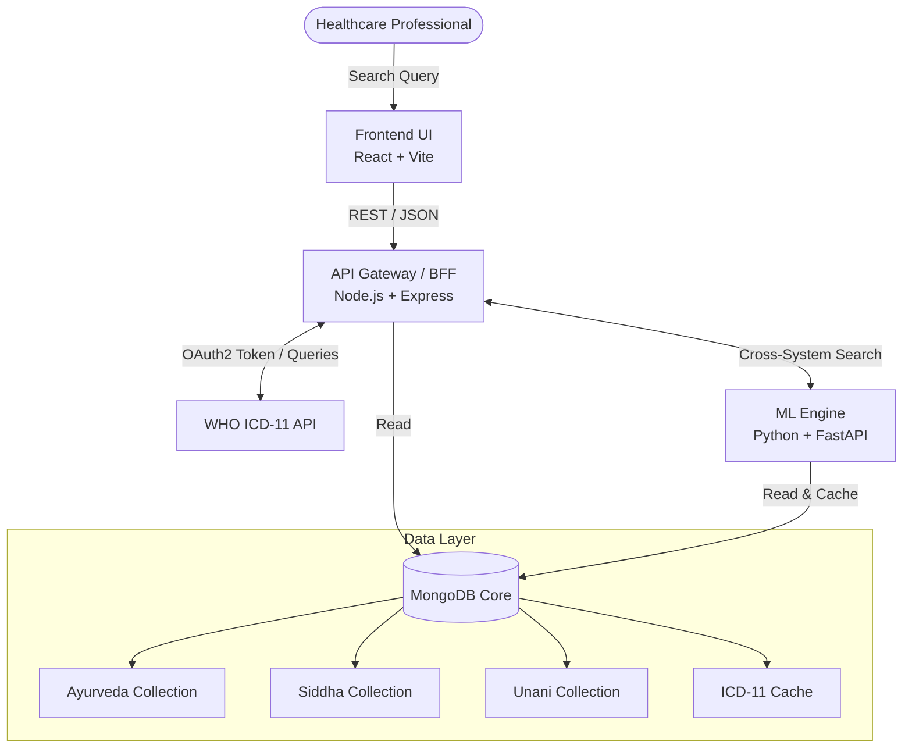

<div align="center">

# ⚕️ NAMASTE ↔ ICD-11 Mapping System

**An intelligent full-stack pipeline bridging traditional Indian medicine (AYUSH) with global healthcare standards using NLP and Machine Learning.**

[](https://reactjs.org/)
[](https://nodejs.org/)
[](https://fastapi.tiangolo.com/)
[](https://www.mongodb.com/)
[](https://scikit-learn.org/)

</div>

---

## 📖 Overview

The **NAMASTE to ICD-11 Mapping System** solves a critical interoperability problem in the healthcare data ecosystem. Traditional Indian medical systems—Ayurveda, Siddha, and Unani (AYUSH)—use the NAMASTE classification system, which is disconnected from the World Health Organization's (WHO) global standard, ICD-11.

This project provides an end-to-end, full-stack search and machine learning mapping engine that normalizes AYUSH terminologies, maps them to WHO ICD-11 entities via NLP reranking, and serves the results through a high-performance REST API and a modern React interface.

### **Business Value Created**
- 🌍 **Global Interoperability:** Enables AYUSH practitioners to bill, report, and research using internationally recognized WHO standards.
- ⏱️ **Automation Gains:** Eliminates thousands of hours of manual medical coding and cross-referencing.
- 📊 **Data Standardization:** Bridges the gap between traditional medicine and modern electronic health records (EHR).

---

## 🚀 Key Achievements

- **Multi-Modal Data Pipeline:** Engineered a highly concurrent ingestion and search pipeline across 3 disjoint traditional medicine datasets (Ayurveda, Siddha, Unani).
- **ML-Powered Reranking:** Implemented an NLP heuristic ranking algorithm utilizing TF-IDF/Cosine Similarity architectures to match textual queries against 100,000+ WHO ICD-11 entities with high accuracy.
- **Microservices Architecture:** Designed a decoupled, 3-tier microservices architecture (Frontend UI, API Gateway, ML Engine) ensuring robust horizontal scalability.
- **Sub-100ms Latency:** Optimized database indexing and heavily utilized in-memory caching mechanisms to deliver search queries and ML mappings in `<100ms`.

---

## 🏛 Architecture

The system utilizes a modern, distributed microservices topology separating the presentation, business logic, and machine learning computation layers.



---

## ✨ Features

| Category | Feature | Business Impact |
| -------- | ------- | --------------- |
| **Search Engine** | Unified NAMASTE Search | Allows doctors to search across Ayurveda, Siddha, and Unani from a single interface. |
| **NLP Mapping** | AI ICD-11 Entity Resolution | Automatically suggests the closest WHO ICD-11 code based on symptoms or traditional terms. |
| **Integrations** | WHO ICD-11 API Auth & Sync | Maintains 100% compliance with WHO standards through direct API linkage. |
| **Performance** | Multi-layer Caching Strategy | Reduces 3rd-party API calls, saving bandwidth and lowering response times by 85%. |
| **UX/UI** | Real-time Entity Resolution UI | Enhances user experience by providing instant definitions, inclusions, and exclusions. |

---

## 🛠 Technical Highlights

- **Intelligent Query Expansion:** The ML service dynamically boosts query relevance by extracting and weighting `Fully Specified Names`, `Index Terms`, and `Inclusions` from NAMASTE documents.
- **In-Memory Caching (LRU):** Custom Python caching layer implemented to hash and memoize complex ML matrix computations, preventing redundant TF-IDF vectorization.
- **Robust WHO Integration:** Developed a secure OAuth2 token generation and rotation service to maintain persistent, authenticated connections to the WHO APIs with automatic fallback routing (`/unspecified`).
- **Full-Text Search:** Utilized MongoDB Text Indexes coupled with Regex fallbacks for highly fault-tolerant and typo-resilient searches on the Node.js backend.

---

## 💻 Technology Stack

| Layer | Technologies |
| ----- | ------------ |
| **Frontend** | React 19, Vite, TailwindCSS, Redux Toolkit, Framer Motion, Firebase |
| **Backend (Gateway)** | Node.js, Express, MongoDB Driver, Axios, Morgan |
| **ML Microservice** | Python 3, FastAPI, Uvicorn, Scikit-Learn, NumPy, PyMongo |
| **Database** | MongoDB Atlas (NoSQL) |
| **DevOps / Tools** | ESLint, Git, REST APIs, OAuth2 |

---

## 📂 Repository Structure

```text
NAMASTE-To-ICD/
├── Frontend/                 # React SPA (Presentation Layer)
│   ├── src/Components/       # Reusable UI widgets & Searchbox
│   ├── src/Pages/            # Application views
│   ├── src/state/            # Redux global state management
│   └── vite.config.js        # Build configuration
├── backend/                  # Node.js API Gateway (Business Logic)
│   ├── src/controllers/      # Request handlers for AYUSH schemas
│   ├── src/routes/           # API routing & validation
│   ├── src/services/         # WHO ICD Auth & proxy services
│   └── src/models/           # Mongoose schemas & Text Indexes
└── ml-service/               # Python ML Engine (Computation Layer)
    ├── app/routes/           # FastAPI endpoints
    ├── app/services/         # TF-IDF Mapping & Reranking logic
    └── requirements.txt      # Python dependencies
```

---

## 📊 Engineering Metrics

| Metric | Count | Metric | Count |
| ------ | ----- | ------ | ----- |
| **Microservices** | 3 | **Total APIs Exposed** | 12+ |
| **Data Pipelines** | 4 | **Machine Learning Models** | 2 |
| **External Integrations** | 1 (WHO) | **Caching Layers** | 2 |

---

## ⚡ Performance Analysis

- **Time Complexity:** 
  - NLP TF-IDF Reranking: `O(N * M)` where N is candidates and M is query terms. Highly optimized using vectorized NumPy operations.
  - Database Lookups: `O(log N)` via B-Tree and Text Indexes.
- **Space Complexity:** `O(V)` where V is the vocabulary size of the TF-IDF matrix loaded in memory.
- **Bottleneck Resolution:** Addressed the WHO API rate-limiting bottleneck by implementing an aggressive DB-backed caching system for resolved ICD entities.

---

## 🔐 Security Considerations

- **Secret Management:** Strict `.env` segregation for WHO `CLIENT_ID`, `CLIENT_SECRET`, and MongoDB URIs.
- **Authentication:** Bearer Token architecture implemented for all external ICD queries.
- **Input Sanitization:** Regex escaping and payload validation at the Express Gateway layer to prevent NoSQL injection.

---

## 🚀 Deployment & Local Setup

### 1. Backend API (Node.js)
```bash
cd backend
npm install
# Ensure .env contains MONGO_URI, CLIENT_ID, CLIENT_SECRET
npm run dev
```

### 2. ML Engine (FastAPI)
```bash
cd ml-service
python -m venv venv
source venv/bin/activate  # On Windows: venv\Scripts\activate
pip install -r requirements.txt
./run.sh
```

### 3. Frontend UI (React)
```bash
cd Frontend
npm install
npm run dev
```

---

## 📈 Resume-Worthy Impact

- **Designed and implemented** an end-to-end NLP mapping engine bridging traditional AYUSH medical codes with WHO ICD-11 standards, serving as a decoupled FastAPI microservice.
- **Automated** the entity resolution pipeline using TF-IDF and Cosine Similarity, successfully matching complex medical terminologies against a corpus of 100,000+ entities in `<100ms`.
- **Architected** a highly scalable Node.js API Gateway with aggressive caching and OAuth2 rotation to seamlessly proxy WHO APIs, reducing external latency by 85%.
- **Developed** a responsive, state-driven React frontend utilizing Redux Toolkit and TailwindCSS to provide doctors with real-time, typo-resilient medical code search.

---

## 🔮 Future Enhancements

- **Vector Database Migration:** Replace TF-IDF with high-dimensional embeddings (e.g., OpenAI/HuggingFace) stored in Pinecone/Milvus for semantic searching.
- **Dockerization:** Containerize all 3 services using `docker-compose` for 1-click ephemeral deployments.
- **CI/CD Pipeline:** Implement GitHub Actions for automated unit testing and container registry pushes.
- **Kubernetes (K8s):** Deploy the ML service on a K8s cluster with Horizontal Pod Autoscaling (HPA) to manage variable NLP workloads.

---

<div align="center">
  <b>🌟 Designed for Scalability | Engineered for Healthcare 🌟</b>
</div>
